# Digital Library Platform

[](https://github.com/MohammadaminAlbooyeh/digital-library-platform/actions/workflows/ci.yml)

A full-stack digital library platform with a Spring Boot backend, a Python recommendation
microservice, and Docker-based infrastructure.

## Architecture

```mermaid
graph TB
    subgraph "Client Layer"
        CLIENT[Web / Mobile App]
    end

    subgraph "Edge"
        CDN_S3[S3 CDN<br/>content & covers]
        LB[Load Balancer]
    end

    subgraph "Backend (Spring Boot<br/>Java 17 · port 8080)"
        AUTH[Auth Controller<br/>JWT + Refresh Tokens]
        BOOKS[Book Catalog<br/>/api/books]
        AUDIO[Audiobook Catalog<br/>/api/audiobooks]
        SEARCH[Search Controller<br/>/api/search]
        LIB[Library Controller<br/>/api/library]
        PROGRESS[Reading Progress<br/>/api/progress]
        SUB[Subscription<br/>/api/subscriptions]
        PAY[Payment<br/>/api/payments]
        DRM[DrmController<br/>/api/drm]
        ADMIN[AdminController<br/>/api/admin]

        subgraph "Internal Modules"
            DRM_SVC[DRM Service<br/>license + device mgmt]
            DRM_ENC[ContentEncryption<br/>AES-CBC + KMS]
            DRM_TOKEN[DrmTokenGenerator<br/>HMAC signing]
            DELIVY[ContentDeliveryService<br/>CDN signing + streaming]
            REC[RecommendationClient<br/>calls reco-service]
            KAFKA_PUB[ReadingEventProducer<br/>publishes to Kafka]
        end
    end

    subgraph "Recommendation Service (FastAPI<br/>Python · port 8000)"
        RECO_API["REST /recommendations/{userId}"]
        RECO_MODEL[Embedding Model<br/>bag-of-words + cosine]
    end

    subgraph "Data & Infrastructure (Docker)"
        MYSQL[(MySQL 8.0<br/>Flyway migrations V1–V8)]
        REDIS[(Redis<br/>session cache + refresh tokens)]
        KAFKA[(Kafka<br/>+ Zookeeper)]
        S3[AWS S3<br/>content storage + KMS]
    end

    %% Client traffic
    CLIENT -->|HTTPS| LB
    LB -->|REST API| AUTH
    LB -->|REST API| BOOKS
    LB -->|REST API| AUDIO
    LB -->|REST API| SEARCH
    LB -->|REST API| LIB
    LB -->|REST API| PROGRESS
    LB -->|REST API| SUB
    LB -->|REST API| PAY
    LB -->|REST API| DRM
    LB -->|REST API| ADMIN

    %% Backend → databases
    AUTH -->|users / subscriptions| MYSQL
    BOOKS -->|books / authors / categories| MYSQL
    AUDIO -->|audiobooks| MYSQL
    SEARCH -->|full-text search| MYSQL
    LIB -->|library ownership| MYSQL
    PROGRESS -->|reading progress| MYSQL
    SUB -->|subscriptions / plans| MYSQL
    PAY -->|transactions| MYSQL
    DRM -->|devices / licenses| MYSQL
    ADMIN -->|stats / reports| MYSQL

    %% Backend → Redis
    AUTH -->|refresh tokens| REDIS
    LIB -->|stream/download tokens| REDIS
    DELIVY -->|cache| REDIS

    %% Backend → Kafka
    PROGRESS -->|reading events| KAFKA_PUB
    KAFKA_PUB -->|publish| KAFKA
    RECO -->|consume reading-events| KAFKA

    %% Backend → Recommendation service
    LIB -->|fallback recommendations| REC
    REC -->|HTTP| RECO_API
    RECO_API --> RECO_MODEL

    %% Backend → DRM internal
    LIB -->|DRM license| DRM_SVC
    DRM --> DRM_SVC
    DRM_SVC --> DRM_ENC
    DRM_SVC --> DRM_TOKEN

    %% Backend → Content delivery
    LIB -->|stream/download| DELIVY
    DELIVY -->|signed URL| CDN_S3
    LIB -->|DRM license| DELIVY

    %% Backend → S3 / KMS
    DELIVY -->|fetch content| S3
    DRM_ENC -->|data keys| S3

    style MYSQL fill:#e3f2fd
    style REDIS fill:#ede7f6
    style KAFKA fill:#fff3e0
    style S3 fill:#fce4ec
```



- **Backend** (`src/`) — Java 17 / Spring Boot 3
  - Auth (JWT), book catalog, search, subscriptions, payments
  - DRM module (device registration, license issuance, content encryption)
  - Content delivery (CDN URL signing, download tokens, streaming chunks)
  - Reading progress tracking with Kafka event publishing
  - Redis caching, Flyway migrations, MySQL
- **Recommendation service** (`recommendation-service/`) — Python / FastAPI
  - Exposes `/recommendations/{userId}`
  - Consumes Kafka `reading-events` to build per-user profiles
- **Infrastructure** (`docker/`) — MySQL, Redis, Kafka, Zookeeper

## Prerequisites

- JDK 17+
- Maven 3.8+
- Docker (for full stack)
- Python 3.10+ (for the recommendation service)

## Running the full stack

```bash
cd docker
docker compose up -d
```

This starts MySQL, Redis, Zookeeper, Kafka, the backend (port 8080), and the
recommendation service (port 8000).

## Running the backend locally

```bash
# Start infrastructure only
cd docker
docker compose up -d mysql redis

# Run the app
mvn spring-boot:run
```

The API docs are available at `http://localhost:8080/swagger-ui.html`.

## Configuration

Configuration is externalized via environment variables (see `src/main/resources/application.yml`):

| Variable | Default | Description |
|----------|---------|-------------|
| `DB_URL` | `jdbc:mysql://localhost:3306/dlp...` | JDBC URL |
| `DB_USERNAME` / `DB_PASSWORD` | `dlp` / `dlp` | DB credentials |
| `REDIS_HOST` / `REDIS_PORT` | `localhost` / `6379` | Redis |
| `KAFKA_BOOTSTRAP_SERVERS` | `localhost:29092` | Kafka |
| `JWT_SECRET` | (dev default) | JWT signing secret |
| `S3_BUCKET` / `AWS_REGION` | `dlp-content` / `us-east-1` | S3 |
| `CDN_BASE_URL` | `https://cdn.example.com` | CDN base URL |
| `DRM_ENCRYPTION_KEY` | (dev default) | AES DRM key |

> In production, always override `JWT_SECRET` and `DRM_ENCRYPTION_KEY`.

## API overview

| Method | Path | Description |
|--------|------|-------------|
| POST | `/api/auth/register` | Register a user |
| POST | `/api/auth/login` | Obtain JWT + refresh token |
| POST | `/api/auth/refresh` | Refresh access token |
| POST | `/api/auth/logout` | Revoke refresh token |
| GET | `/api/books` | List books |
| GET | `/api/books/{id}` | Book details |
| GET | `/api/search` | Search books |
| GET | `/api/subscriptions/plans` | List subscription plans |
| POST | `/api/subscriptions/subscribe` | Subscribe |
| POST | `/api/payments/purchase` | Purchase content |
| GET | `/api/library` | My library |
| POST | `/api/library/stream` | Get stream access (+ DRM license) |
| GET | `/api/library/recommendations` | Recommended books |
| PUT | `/api/progress/{contentId}` | Update reading progress |
| GET | `/api/admin/stats` | Admin stats |

## Testing

```bash
mvn test
```

> **JDK note:** This project targets Java 17 and must be built/tested with
> **JDK 17 or 21**. Spring Boot 3.2.x's pinned Lombok has no support for newer
> JDKs, and Mockito's inline mock-maker also fails on JDK 22+ with
> `MockitoException: Mockito cannot mock this class`. If Maven launches on a
> newer default JDK (e.g. Homebrew's `openjdk@26` when `JAVA_HOME` is unset),
> point it at a compatible JDK:
>
> ```bash
> export JAVA_HOME=/path/to/jdk-17-or-21
> mvn test
> ```
>
> The `pom.xml` also overrides Spring Boot's Mockito/ByteBuddy versions to a
> newer pair for robustness, but a JDK ≤21 is still required for the full build.
> (Tip: `unset JAVA_HOME` won't help — the Homebrew `mvn` shim then defaults
> to the latest brew JVM. Set `JAVA_HOME` explicitly.)

### Recommendation service tests

```bash
cd recommendation-service
pip install -r requirements-dev.txt
python -m pytest -q
```

### Continuous integration

`.github/workflows/ci.yml` runs `mvn -B verify` (JDK 21) and the recommendation
service's pytest suite on every push to `main` and every pull request.


